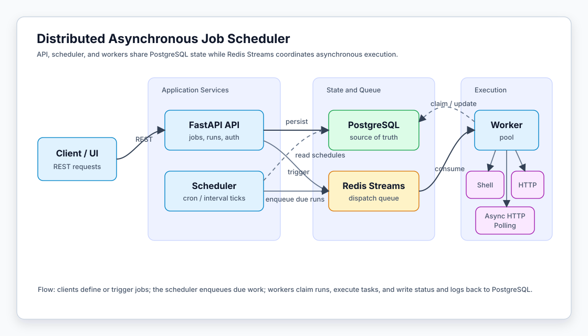

# Distributed Asynchronous Job Scheduler

A distributed asynchronous job scheduling platform built with **FastAPI**, **PostgreSQL**, **Redis Streams**, and horizontally scalable workers. It provides APIs for defining jobs, scheduling recurring work, dispatching runs through a queue, and tracking execution status and logs.

This README is written as a public project overview for reviewers. Internal deployment details and private environment notes are intentionally omitted.

## Highlights

- REST API for jobs, runs, authentication, and health checks.
- PostgreSQL-backed job definitions, dependencies, run history, and logs.
- Redis Streams dispatch queue with worker consumer groups.
- Manual, cron, and interval scheduling modes.
- Shell, HTTP, and long-running async HTTP executors.
- Retry, timeout, cancellation, and log capture for each run.
- DAG-style job dependencies.
- Multi-replica scheduler with PostgreSQL advisory-lock leadership.
- Horizontally scalable workers with idempotent run claiming.
- Docker Compose and Kubernetes manifests for local or demo deployments.

## Architecture



The system separates job definition, scheduling, dispatch, and execution. PostgreSQL is the source of truth for jobs and runs, while Redis Streams coordinates asynchronous worker execution.

## Core Concepts

### Jobs

A job describes what should run and when it should run. Jobs support:

- `manual`, `cron`, and `interval` schedules
- `shell`, `http`, and `http_async` task types
- retry and timeout settings
- optional category and description metadata
- dependencies on other jobs

### Runs

A run is one execution attempt for a job. Runs move through states such as:

```text
pending -> queued -> running -> succeeded / failed / timed_out / canceled
```

Each run records timing, attempt number, worker id, exit code or result payload, error details, and line-oriented logs.

### Dependencies

Jobs can depend on other jobs. When a dependent job is triggered, upstream work is queued first; the downstream job runs only after dependencies have succeeded.

### Executors

- `shell`: runs a command with arguments and captures stdout / stderr.
- `http`: sends a single HTTP request and evaluates the response status.
- `http_async`: submits remote work and polls a status endpoint until completion or timeout.

## API Overview

Business APIs are served under `/api/v1`.

| Area | Examples |
| --- | --- |
| Auth | register, login |
| Jobs | create, list, update, delete, trigger |
| Runs | list, inspect, retry, cancel |
| Logs | fetch run logs |
| Health | liveness and readiness checks |

Interactive OpenAPI documentation is available at `/docs` when the API server is running.

## Repository Layout

```text
backend/
  api/          FastAPI routers and request dependencies
  common/       shared models, schemas, config, metrics, DB and Redis helpers
  scheduler/    schedule calculation and dispatch loop
  worker/       Redis consumer loop and task executors
migrations/     Alembic database migrations
deploy/k8s/     Kubernetes manifests and rollout helper scripts
tests/          unit, integration, and resilience tests
Dockerfile      runtime image
docker-compose.yml
```

## Local Development

Install development dependencies:

```bash
npm run deps
```

Start the API with PostgreSQL and Redis:

```bash
docker compose up --build
```

Start the full pipeline, including scheduler and worker processes:

```bash
docker compose --profile full up --build
```

The API is available at `http://localhost:8000`, with Swagger UI at `http://localhost:8000/docs`.

## Testing

Run unit tests:

```bash
npm run test:run
```

Run integration tests after starting the full stack:

```bash
docker compose --profile full up --build
PYTHONPATH=.deps:. python3 -m pytest tests/integration -m integration
```

A Kubernetes resilience script is also included to validate worker failover behavior.

## Deployment Notes

The repository includes Docker and Kubernetes deployment assets. The Kubernetes setup runs API, scheduler, and worker components as separate workloads, with PostgreSQL and Redis backing services.

For local k3s-style deployments, rebuild and import the application image before restarting workloads, because the manifests are designed to use a locally available image rather than pulling from a public registry.

## Current Scope

This project focuses on the backend scheduling platform:

- API and persistence layer
- distributed scheduling and dispatch
- worker execution and failover
- task logs and status tracking
- deployment manifests for demonstration environments

A production deployment should still review secret management, network exposure, image publishing, observability, and operational policies for its target environment.
